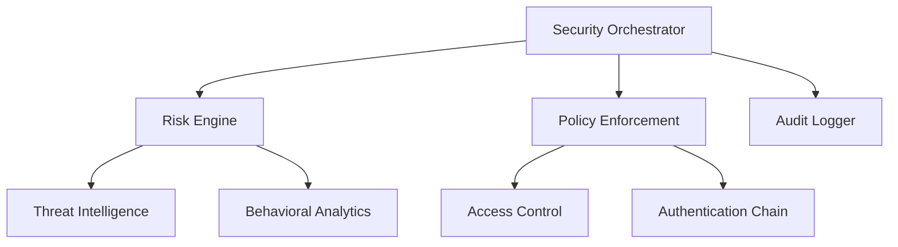

# Security Components Architecture

## Overview
This document describes the security components architecture of the Hybrid Entra ID SSO solution.

## Component Diagram


## Components Description

### Security Orchestrator
The central component responsible for coordinating security responses and managing security incidents.

### Risk Engine
Evaluates security risks based on multiple factors including:
- User behavior
- Device trust
- Location
- Resource sensitivity

### Policy Enforcement
Enforces security policies based on:
- Risk scores
- Compliance requirements
- Access controls
- Authentication requirements

## Implementation Details

### Security Orchestrator
```typescript
class SecurityOrchestrator {
    // Implementation details...
}
```

### Risk Engine
```typescript
class RiskEngine {
    // Implementation details...
}
```

## Deployment Considerations
- High availability requirements
- Scaling considerations
- Monitoring and alerting setup